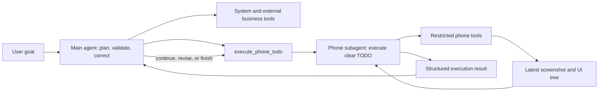

# Phone Subagent Architecture Design

## Context

The backend currently builds one `deepagents.create_deep_agent` instance. The same
agent selects tools, performs phone UI operations, calls system tools, and uses
external business tools. Phone progress is emitted for individual tool calls, and
task complexity is classified once near the start of a run.

The new architecture separates global decision-making from phone UI execution:

- The main agent observes results, chooses the next task, advances or corrects
  TODO items, and decides when the user goal is complete.
- A phone subagent translates one clear TODO into restricted phone tool calls.
- Main-agent TODO progress is streamed to the existing frontend contract.
- The existing offline local-model safety boundary remains conservative.

## Goals

1. Force cloud-mode phone UI operations through a dedicated phone subagent.
2. Keep system tools and external business tools directly available to the main
   agent.
3. Allow an independently configured phone subagent model with a safe fallback to
   the main cloud model.
4. Default to one clear phone TODO per delegation while allowing a bounded short
   chain for deterministic actions.
5. Stream TODO-level progress and permit the known total step count to change
   while the main agent corrects or extends a plan.
6. Preserve the existing offline behavior: simple low-risk actions only, with no
   complex multi-agent loop.

## Non-Goals

- Replacing the LangGraph Server transport or adding a new progress endpoint.
- Allowing the phone subagent to call system, Feishu, WeCom, map, or weather
  tools.
- Allowing offline local models to autonomously run complex UI workflows.
- Replacing the current heuristic task-complexity classifier with a full planner.
- Exposing screenshot base64 data in delegation results.

## Selected Architecture

Use a delegation tool inside the existing Deep Agent main loop.



This approach keeps the current Deep Agent integration and adds a hard tool
boundary. In cloud mode, the main agent does not receive raw phone tools, so it
cannot bypass delegation.

## Components

### Main Agent Factory

The main-agent factory registers two tool sets:

- Cloud mode: `execute_phone_todo`, system tools, and external tools.
- Offline local mode: the existing restricted direct phone tools and existing
  local-model prompt.

The graph is built once at process startup, so a middleware filters the tools
exposed to the model on every model request:

- Cloud requests hide raw phone tools and expose `execute_phone_todo`.
- Offline local-model requests hide `execute_phone_todo` and expose raw phone
  tools for the existing restricted single-step behavior.

A network disconnect switches the existing agent to the local model and changes
the exposed tool subset without rebuilding the graph. All registered tools remain
server-side, but a model cannot select tools hidden from its request.

### Phone Subagent

`mobile_agent/agent/phone_subagent.py` builds and invokes the phone subagent.

It receives:

- A clear phone UI TODO.
- Whether a deterministic short chain is allowed.
- A configured maximum phone-tool-call budget.
- Access to the current phone gateway.

It exposes only restricted phone tools such as `observe`, `launch`, `tap`, `type`,
`swipe`, `back`, `home`, `keyevent`, `wait`, `interact`, and `take_over`.

The phone subagent must stop when:

- The TODO is complete.
- A target is ambiguous.
- User action is required for login, password, CAPTCHA, payment, biometric, or
  authorization steps.
- Its tool-call budget is exhausted.
- The same action repeatedly fails.

### Phone Delegation Tool

`mobile_agent/agent/phone_delegation.py` creates the main-agent tool
`execute_phone_todo`.

Input:

```json
{
  "todo": "Tap the visible search box on the home page",
  "allow_short_chain": false
}
```

`allow_short_chain` defaults to `false`. When it is `true`, the phone subagent may
perform a small bounded sequence of deterministic UI operations. It still returns
control when it needs a planning decision.

Output:

```json
{
  "status": "completed",
  "todo": "Tap the visible search box on the home page",
  "summary": "Tapped the visible search box and the field is now focused.",
  "phoneState": {
    "currentPackage": "com.example.app",
    "activity": ".MainActivity",
    "hasScreenshot": true,
    "hasUi": true
  },
  "toolCallCount": 1,
  "needsMainAgentPlan": true,
  "error": null
}
```

Supported status values:

- `completed`
- `failed`
- `needs_user_action`
- `budget_exhausted`

The result includes only a summary of the latest phone state. Screenshot base64
and raw UI trees are not returned to the main agent through the delegation tool.

### Phone Subagent Model

`mobile_agent/local_model_runtime.py` gains a cloud-mode phone-subagent model
builder.

Configuration:

- `PHONE_SUBAGENT_MODEL`
- `PHONE_SUBAGENT_BASE_URL`
- `PHONE_SUBAGENT_API_KEY`
- `PHONE_SUBAGENT_MAX_TOKENS`
- `PHONE_SUBAGENT_MAX_TOOL_CALLS`
- `PHONE_SUBAGENT_SHORT_CHAIN_MAX_TOOL_CALLS`

When the phone-subagent model is not configured, the builder returns the main
cloud model. Offline mode continues using the existing llama.cpp runtime and does
not start the cloud-mode delegation loop.

## Prompt Responsibilities

The main cloud prompt is updated so the main agent:

1. Maintains the user-level plan.
2. Creates one clear phone TODO at a time.
3. Uses `allow_short_chain=true` only for deterministic local actions.
4. Validates each phone-subagent result before issuing the next TODO.
5. Corrects the plan when a result differs from expectations.
6. Calls system and external business tools directly when they are the correct
   source.

The phone-subagent prompt is narrower:

1. Execute the provided phone TODO only.
2. Use current screenshot and UI-tree context before acting.
3. Do not invent coordinates or continue into unrelated goals.
4. Respect the tool budget and stop for risky or ambiguous steps.
5. Return a short structured summary for the main agent.

## TODO Progress

The existing `task_progress` stream contract remains the transport. It gains an
optional `progressKey` field. TODO events use `phase="agent"` and a stable
per-TODO `progressKey` so the frontend can update the same row without collapsing
different TODO items into one row.

Example:

```json
{
  "type": "task_progress",
  "label": "Tap the visible search box",
  "status": "running",
  "phase": "agent",
  "toolName": "execute_phone_todo",
  "progressKey": "phone-todo-2",
  "currentStep": 2,
  "totalSteps": 3,
  "completedSteps": [
    {
      "index": 1,
      "name": "Launch Meituan",
      "status": "completed"
    }
  ]
}
```

The main agent may revise or extend its plan after observing results. Therefore:

- `totalSteps` is the number of currently known TODO items, not an immutable
  estimate.
- `currentStep` refers to the TODO currently executing.
- `completedSteps` contains immutable completion summaries for completed TODOs.
- `progressKey` identifies one TODO row. `toolName` remains the stable tool type
  for backward compatibility.
- Atomic phone-tool progress continues to stream from the existing wrappers.

The first implementation keeps TODO state scoped to one run. The delegation
tracker appends TODO items as the main agent discovers them, so `totalSteps` can
grow after each validation round. A corrected TODO is a new item with a new
`progressKey`; the failed prior item remains visible. The implementation does not
add a cross-run durable plan store.

## Error Handling

- Phone tool errors are returned to the phone subagent and streamed through the
  existing atomic tool progress.
- Delegation emits a TODO-level `failed` event when execution fails.
- The main agent may issue a corrected TODO after a failure.
- Repeated failure or budget exhaustion returns control to the user with a clear
  explanation.
- Login, password, CAPTCHA, payment, biometric, and authorization screens return
  `needs_user_action`; they are never automated.
- Delegation errors do not leak screenshot base64, secrets, or raw credentials.

## Offline Behavior

When `/network/status` is updated with `connected=false`, the existing local
llama.cpp runtime is used. Offline mode does not enter the main-agent and phone-
subagent delegation loop.

The existing conservative local prompt remains authoritative:

- Zero or one low-risk tool call per model round.
- No multi-step automation.
- No continuous clicking, typing, or cross-app workflows.
- Stop and explain when a complex task requires a stronger model or user action.

## Testing Strategy

Implementation follows TDD: add failing tests before production code, then make
the minimum implementation pass and refactor while keeping tests green.

Automated tests cover:

1. Cloud-mode main-agent tools include `execute_phone_todo`, system tools, and
   external tools, but exclude direct phone tools such as `tap` and `type`.
2. Tool-filtering middleware changes the exposed subset without rebuilding the
   graph.
3. Offline local-mode tools retain the existing restricted direct phone
   capability.
4. Phone-subagent tools contain only phone tools.
5. A configured phone-subagent model is used when present.
6. The main cloud model is reused when no phone-subagent model is configured.
7. Delegation defaults to one clear TODO and enforces a bounded short-chain
   budget.
8. Delegation results use the documented structured status shape and do not
   expose screenshot base64.
9. TODO creation, completion, correction, and failure emit dynamic
   `task_progress` chunks with `phase="agent"` and per-TODO `progressKey`.
10. Existing weather, system read, CLI safety, current-time, and progress tests
   remain green.

## Scenario Acceptance

1. `观察当前页面并点击搜索框`
   - The main agent delegates a phone TODO.
   - The phone subagent observes and taps the visible target.
   - TODO and atomic tool progress are streamed.

2. `打开美团并搜索小碗菜`
   - The main agent advances TODO items based on phone results.
   - A deterministic short chain may execute inside the phone subagent.
   - The plan can be corrected if the page differs from expectations.

3. `查询深圳天气`
   - The main agent calls the external weather tool directly.
   - The phone subagent is not invoked.

4. Login or CAPTCHA encountered during phone execution
   - The phone subagent stops and returns `needs_user_action`.
   - The backend asks the user to take over.

5. Complex UI request while offline
   - The local model refuses complex autonomous execution.
   - No cloud-mode delegation loop starts.
